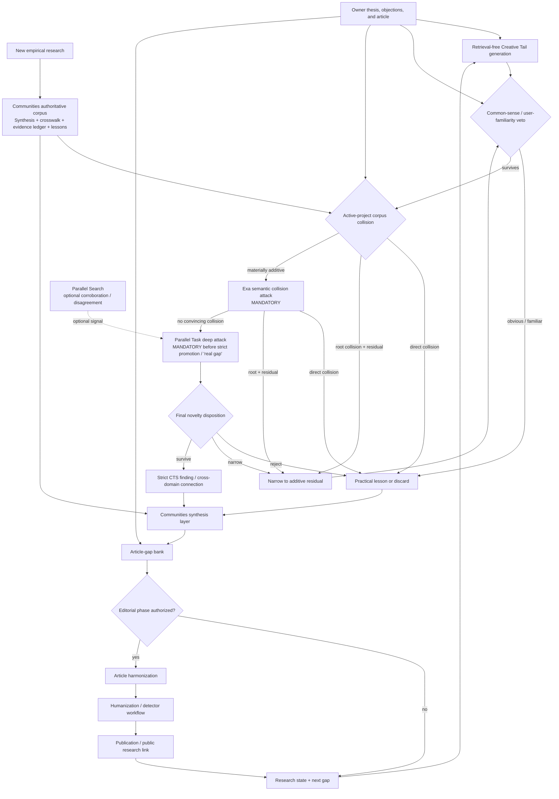
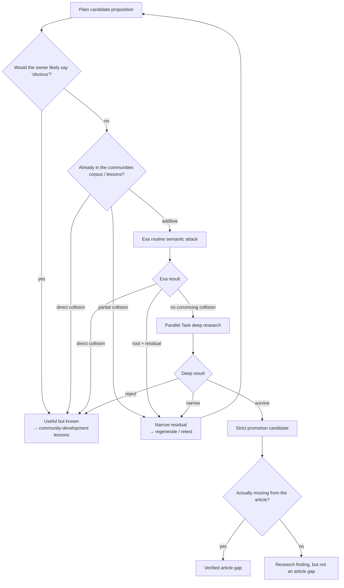
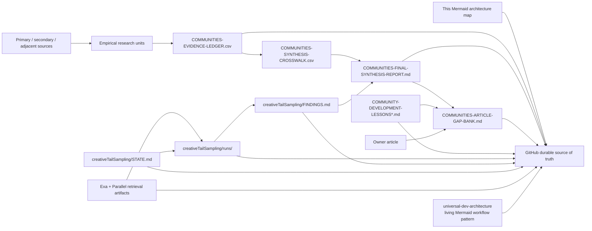

# Communities research → Creative Tail → article workflow architecture

Updated: 2026-08-16

Purpose: keep the end-to-end control flow visible in one source-controlled place. This map complements the prose state; it does not replace the evidence ledger, synthesis, gap bank, or branch-specific handoffs.

## 1. End-to-end overview

### Reading rule

- Generation remains retrieval-free.
- A candidate may be discussed provisionally before external retrieval, but it must not be presented as a **real article gap**, **strict novelty survivor**, or **new finding** until it survives the internal corpus gate, mandatory Exa attack, and mandatory Parallel Task deep attack.
- Parallel Search is optional after Round 001 showed no incremental recall over Exa; use it for corroboration or provider disagreement, not as a required routine lane.
- Owner objections are first-class search evidence and update the rejection frontier immediately.

## 2. Novelty / promotion drill-down

### Round 001 retrieval verdict encoded here

The production architecture follows the completed benchmark:

- Exa Search: 8/8 historical false-novelty catches.
- Parallel Search: materially weaker routine recall and no incremental catch over Exa in that round.
- Parallel Task `pro`: materially useful on all five escalated survivor/boundary cases and sharply narrowed several survivors.

Therefore:

1. Exa routine attack is mandatory.
2. Parallel Search is optional.
3. Parallel Task deep attack is mandatory before strict originality promotion or before telling the owner that a candidate is a verified real gap.

## 3. Evidence, article, and persistence dataflow

## 4. Canonical file roles

| Layer | Canonical artifact | Role |
|---|---|---|
| Recovery / authority | `docs/FRESH-CONVERSATION-HANDOFF.md`, `recovered/COMMUNITIES-RESEARCH-STATE.md` | Restore exact checkpoint and boundaries |
| Evidence | `recovered/COMMUNITIES-EVIDENCE-LEDGER.csv` | Source-level factual authority and limits |
| Synthesis | `recovered/COMMUNITIES-FINAL-SYNTHESIS-REPORT.md`, crosswalk | Horizontal interpretation of the evidence base |
| Practical design | `COMMUNITY-DEVELOPMENT-LESSONS.md` + tail batches | Useful lessons even when novelty fails |
| Creative Tail | `u-dont-existDOTcom/creativeTailSampling` | Novelty search, rejection frontier, retrieval attacks |
| Article changes | `recovered/COMMUNITIES-ARTICLE-GAP-BANK.md` | What the article is missing, partially contains, or gets wrong |
| Workflow visualization | `docs/COMMUNITIES-WORKFLOW-ARCHITECTURE.md` | Living visual control map |
| Universal pattern | `u-dont-existDOTcom/universal-dev-architecture/patterns/living-mermaid-workflow-maps.md` | Cross-project rule for maintaining visual architecture |

## 5. Update triggers

Update this map whenever any of these change materially:

- promotion/rejection gates;
- provider roles or retrieval architecture;
- authoritative repositories or files;
- research-to-article handoff;
- editorial authorization state;
- persistence/checkpoint topology;
- a new feedback loop becomes operationally important.

Do not add every small script or artifact to the overview. Put detail in a drill-down diagram and keep the top-level map readable.
