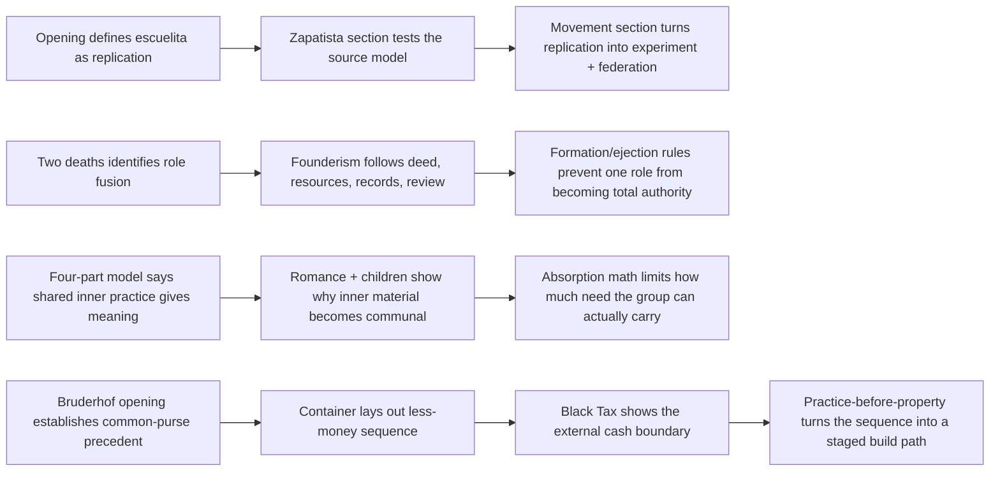

# Building Healing Community — r05 architecture

<!-- article-id: building-healing-community -->

Indexes owner-supplied Substack baseline SHA-256 `d4e46ce84636ab038b1e3b80f1a6f6246242b8e482d43ed648b51595d441eab5` and r05 architecture-fixed candidate SHA-256 `ccdbca020251e9fab8d60c5ce343d8e42347581e9f13a63e568a0154eb6098bc`.

```mermaid
flowchart TD
    A["Opening: father, Bruderhof, escuelita mission"] --> B["Why now: renewed commune interest + freeloader objection"]
    B --> C["Two recurring deaths: secular pain becomes politics / spiritual depth becomes concentrated authority"]
    C --> D["Four-part model: inner pl/ork + relational pl/ork + medicine pl/ork + container"]
    D --> E["Medicine deep dive: value, risks, peer-held limits"]
    E --> F["Technosphere boundary: choose dependencies rather than default adoption"]
    F --> G["Romance: couple conflict becomes community conflict"]
    G --> H["Children: village care + Liedloff + direct rights + adult exit"]
    H --> I["Zapatistas: closest integrated example; practice before theory"]
    I --> J["From one community to a movement: experiment locally + federate without a new sovereign"]
    J --> K["Founderism: follow actual power and preserve override"]
    K --> L["Absorption math: attention/free-resource capacity + who can be absorbed now"]
    L --> M["Forming group: values → resources/land/exit → staged membership → fair ejection"]
    M --> N["Dissolution: continuity of people and basic functions"]
    N --> O["Sénégal: living communal baseline + exclusion + Black Tax/money boundary"]
    O --> P["Practice before property: start where you are → first month actions"]
    P --> Q["Appendix and research trail"]
```

## Important setup → payoff routes

## r05 structural repairs

- Consolidated **How Much Attention Do You Actually Have for Other People?** into **The Math of Absorption, and Who This Isn’t For**. The unique setup paragraphs now immediately precede the free-resource arithmetic they were preparing.
- Moved **Please Choose the Values Before Falling in Love With the View** from the child branch into the forming-group branch before resources/land.
- Added **From One Community to a Movement** above experimentation and federation so those sections no longer read as Zapatista subsections.
- Moved **Practice Comes Before Property / If You Can’t Move / What to Do This Month** out of the Sénégal branch and made them the article's closing action sequence.
- Promoted Appendix and its subsections to a coherent H1→H2 hierarchy.
- Removed two repeated escuelita explanations; the opening defines the idea, the Zapatista section supplies the evidence.
- Retained the shared-inner-purpose statement once as the four-part model's motive; federation now describes what that outward purpose *does* instead of restating why purpose matters.
- Moved the sexuality/gender compatibility paragraph into **Please Choose the Values Before Falling in Love With the View**, where its “that list” antecedent now exists.
- Moved the Bruderhof/transmission reflection after **What to Do This Month**, making it the true ending rather than an ending followed by additional instructions.
