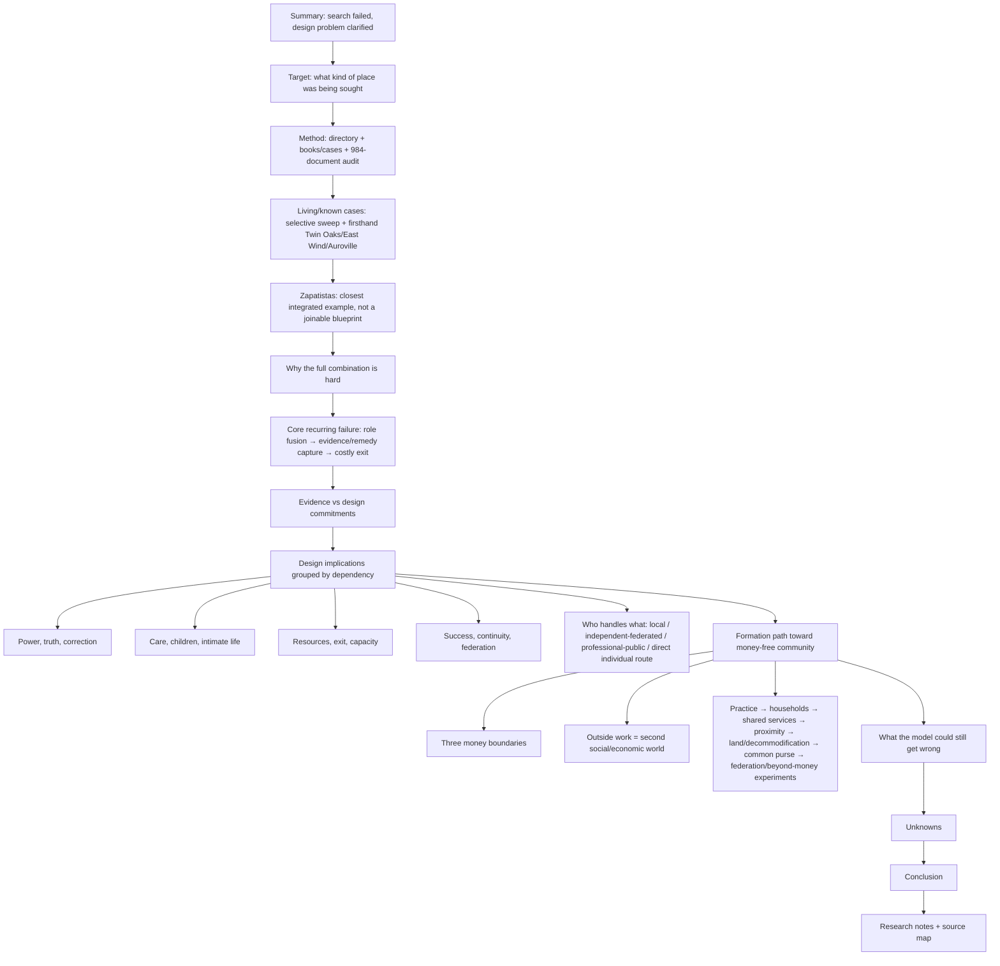
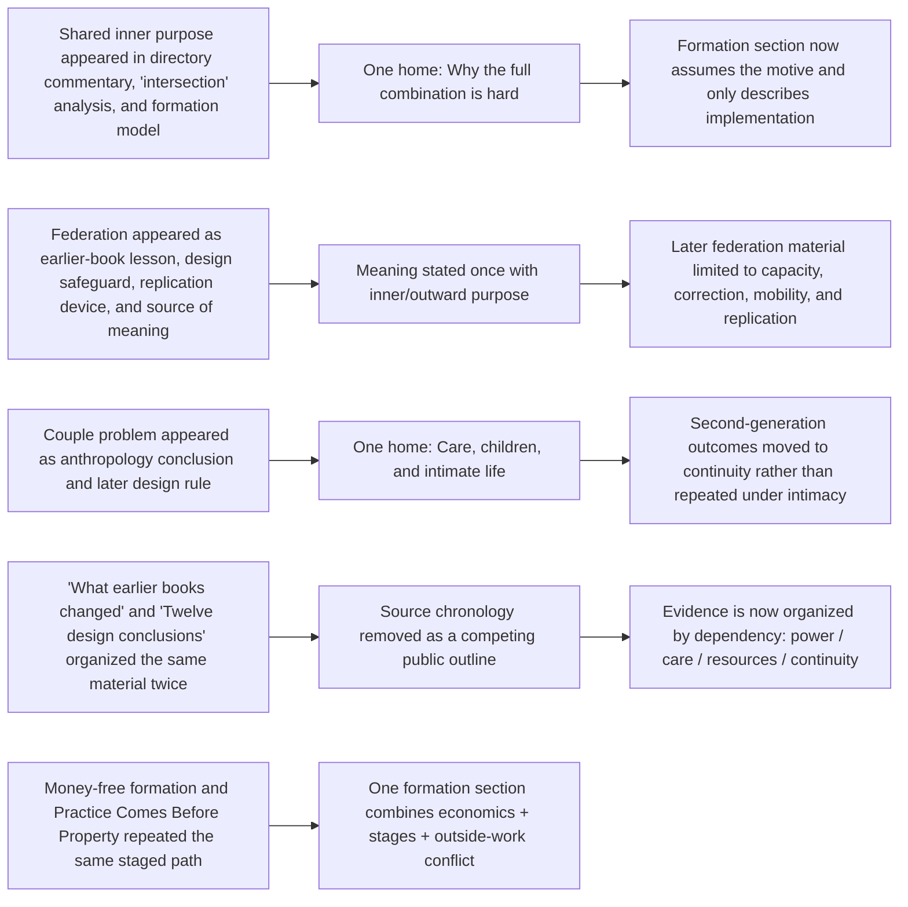

# Community research report — r05 architecture

<!-- report-id: community-research-report -->

Indexes r04 Ghost baseline SHA-256 `db6ad5777595124a2cbdded2a467c6c43b403019a70ec752c7006fdede647ee1` and r05 reorganized Ghost candidate SHA-256 `d90b7904ad1c4460b7ad426ab116f71db3b83d5b3c97f5e9fc9537ce692bf6d2`.

## Deduplication logic

## True stopping point

The report ends after the evidence/design boundary is restated in the conclusion and the source map is provided. It does **not** add another summary of the design after the source map. A second cold audit also removed the last literal duplicate “beautiful land…” paragraph left by the formation-section consolidation.
